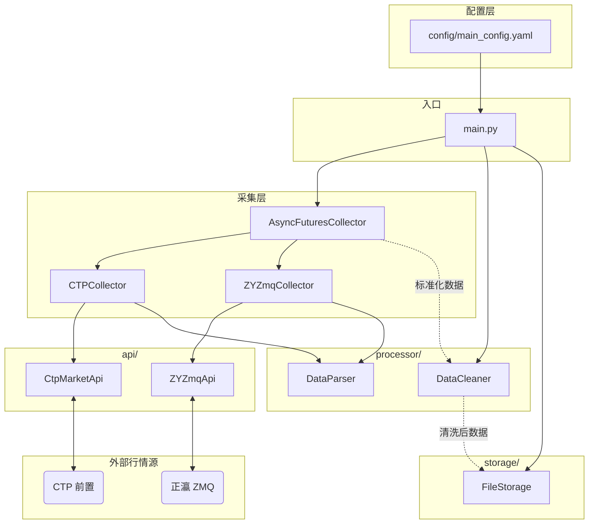
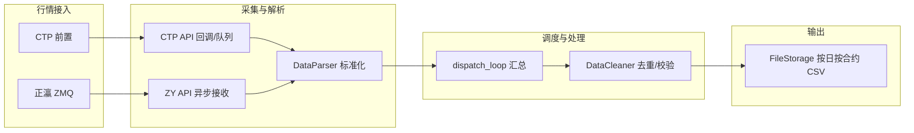

# 期货行情多源整合量化框架

## 项目介绍

基于Python开发的期货行情通用工程框架，适配**正瀛/CTP/广发环网/广期所**多源行情，实现行情采集-解析-处理-存储的标准化流程，支持异步高实时性采集、多源数据格式统一、可配置存储策略，可作为期货量化分析/行情服务的基础框架。

该框架主要完成正瀛/CTP/广发环网/广期所行情采集、异常检测、主力合约编制等功能。

## 框架核心特点

1. **多源行情适配**：原生支持正瀛（DCE/CZCE）、CTP（SHFE/INE/DCE/CZCE）、广发环网/广期所（全交易所）行情源，可灵活开关；
2. **异步高实时**：默认采用aiohttp/websockets异步采集，适配期货Tick级行情高实时性要求；
3. **标准化数据**：统一多源行情数据格式，定义核心必选字段，保证数据一致性；
4. **可配置化**：所有参数（行情源/采集策略/存储方案/日志）均通过YAML配置文件管理，无需修改代码；
5. **工程化设计**：面向接口编程、自定义业务异常、全链路日志、上下文管理器，保证代码可维护性和鲁棒性；
6. **易扩展**：模块化分层设计，新增功能/行情源/存储方案无需修改原有代码，仅需实现对应接口。

## 框架设计：模块交互流程图

### 模块方框图

下图展示各模块的层次关系与依赖方向（配置 → 入口 → 采集/处理/存储）。



### 数据流与运行时流程

从行情源到落盘的整体数据流与调用关系如下。



**流程简述**：

1. **main.py** 加载配置，创建 `AsyncFuturesCollector`、`DataCleaner`、`FileStorage`，并完成连接初始化与订阅。
2. **采集层**：CTP 通过回调写入队列，正瀛通过 ZMQ 异步接收；各子采集器在 `collect_data()` 中从队列取原始数据，经 **DataParser** 转为统一格式。
3. **AsyncFuturesCollector** 的 `dispatch_loop` 定期汇总各采集器数据，调用 **data_callback**，将标准化数据交给 **DataCleaner** 清洗。
4. 清洗后的数据由 **FileStorage** 按合约、按日写入 `data/market_data/` 下的 CSV 文件。

## 环境搭建

### 基础环境

Python 3.14+（当前环境已验证支持 3.14.0）

### 依赖安装

克隆项目后，在项目根目录执行以下命令一键安装所有依赖：

```bash
# 创建虚拟环境
python3 -m venv .venv

# 激活虚拟环境 (macOS/Linux)
source .venv/bin/activate

# 激活虚拟环境 (Windows)
# .venv\Scripts\activate

```bash
# 安装依赖
pip install -r requirements.txt
```

### CTP Pybind 编译说明

由于 CTP SDK 是 C++ 编写的，项目使用了 `pybind11` 进行封装。项目支持 **macOS** 和 **Linux** 两个平台，CMakeLists.txt 会根据当前编译环境自动选择对应的 SDK 版本（`macos/` 或 `linux/` 目录）。

编译步骤：

```bash

# 1. 进入编译目录
cd extern_libs/ctp_pybind

# 2. 编译（CMake 会自动检测平台并选择对应的 SDK）
mkdir -p build && cd build
# 如果 cmake 找不到 pybind11，可以手动指定路径：
# cmake .. -Dpybind11_DIR=$(python3 -c "import pybind11; print(pybind11.get_cmake_dir())")
cmake ..
make

# 3. 配置 Python 调用环境
# 方式 A：修改配置文件 (推荐)
# 在 src/config/main_config.yaml 中设置 pybind_path 为编译输出目录
# ctp:
#   pybind_path: "extern_libs/ctp_pybind/build"

# 方式 B：手动拷贝
# macOS: 将生成的 ctp_pybind*.so 或 ctp_pybind*.dylib 拷贝到项目根目录
# Linux: 将生成的 ctp_pybind*.so 拷贝到项目根目录
cp ctp_pybind*.* ../../../

# 方式 C：设置 PYTHONPATH
export PYTHONPATH=$PYTHONPATH:$(pwd)

# 4. 配置 CTP SDK 依赖路径
# Linux: 编译完成后，build 目录下已自动包含 libThostmduserapi_se.so
#        确保系统加载路径包含该目录
export LD_LIBRARY_PATH=$LD_LIBRARY_PATH:$(pwd)

# macOS: 编译完成后，build 目录下已自动包含 thostmduserapi_se
#        macOS 通常不需要额外设置，因为使用了 @loader_path
```

**注意**：

- CMakeLists.txt 会自动根据编译环境（`APPLE` 或 `UNIX`）选择 `macos/` 或 `linux/` 目录下的 SDK
- macOS 和 Linux 的库文件命名可能不同，但编译脚本会自动处理
- 编译完成后，CTP SDK 的库文件会自动复制到 build 目录

## 快速运行

### 配置说明

修改配置：编辑 `src/config/main_config.yaml`，替换行情源地址、API 密钥、数据库配置等为实际信息，开启 / 关闭所需行情源。

#### CTP 配置格式

项目支持两种 CTP 配置格式：

**1. YAML 格式（项目主配置）**

在 `src/config/main_config.yaml` 中配置：

```yaml
market_sources:
  ctp:
    enable: true
    host: "tcp://182.254.243.31:40011"  # SimNow 行情地址
    broker_id: "9999"                    # 可选，未提供则使用匿名登录
    investor_id: "your_id"               # 可选
    password: "your_password"             # 可选
    subscribe_codes: ["rb2505", "au2506"]
    pybind_path: "extern_libs/ctp_pybind/build"
```

**2. TOML 格式**

支持使用 TOML 格式配置文件（如 `config/ctp_config_simnow.toml`）：

```toml
front_address = "tcp://182.254.243.31:40011"
# 登录信息（可选，如果未提供则使用匿名登录）
# broker_id = "9999"
# investor_id = "your_investor_id"
# password = "your_password"
subscribe_symbols = ["rb2505", "au2506"]
interest_exchanges = ["CFFEX", "SHFE", "DCE", "INE", "CZCE", "GFEX"]
```

**注意**：使用匿名登录（空登录字段），某些 CTP 前置服务器允许行情接口匿名登录。如果配置文件中未提供登录信息，将自动使用匿名登录。

#### CTP API 实现特性

特性如下：

1. **自动连接-登录-订阅流程**：
   - 连接成功后自动登录（`OnFrontConnected` → `login()`）
   - 登录成功后自动订阅（`OnRspUserLogin` → `subscribe()`）

2. **完整的回调处理**：
   - `OnFrontConnected`: 前置连接成功
   - `OnRspUserLogin`: 登录响应
   - `OnRspSubMarketData`: 订阅响应
   - `OnRtnDepthMarketData`: 行情数据推送
   - `OnRspError`: 错误响应

### 启动项目

启动项目：在项目根目录执行以下命令启动行情采集主程序：

```bash
# 方式 1：直接运行（推荐）
python3 src/main.py

# 方式 2：使用模块方式运行
python3 -m src.main

# 方式 3：使用自定义配置文件
python3 src/main.py -c config/ctp_config_simnow.toml
```

**注意**：请确保在项目根目录下运行，程序会自动将项目根目录添加到 Python 路径中。

### 集成测试

集成测试统一在 `src/main.py` 中进行。可以通过修改配置文件来测试不同的行情源：

```bash
# 使用默认配置运行
python3 src/main.py

# 或修改 src/config/main_config.yaml 后运行
```

## 项目结构

```sh
futures_quant_framework/
├── src/          # 核心源码（分层模块化设计）
├── data/         # 数据存储目录（自动生成，分临时/历史/异常数据）
├── docs/         # 设计文档/接口文档
├── tests/        # 单元测试用例
├── config/       # 配置文件目录（包含 CTP 配置示例）
├── extern_libs/  # 外部库（CTP SDK 等）
├── .gitignore    # Git忽略文件
├── requirements.txt # 依赖清单（指定具体版本）
└── README.md     # 项目说明文档
```

## 测试

### 单元测试

项目使用 `pytest` 进行单元测试，测试文件位于 `tests/` 目录。运行前请确保在**项目根目录**下，且已安装依赖（`pip install -r requirements.txt`，其中包含 `pytest`）；推荐在虚拟环境中执行。

#### 如何运行单元测试

```bash
# 进入项目根目录
cd /path/to/futures_quant_framework

# 建议先激活虚拟环境（若使用）
# source .venv/bin/activate   # macOS/Linux
# .venv\Scripts\activate     # Windows

# 运行所有单元测试
pytest tests/

# 带详细输出
pytest tests/ -v

# 运行指定测试文件
pytest tests/test_data_parser.py
pytest tests/test_ctp_api.py

# 运行指定测试类或用例
pytest tests/test_data_cleaner.py::TestDataCleaner::test_clean_deduplication
pytest tests/test_ctp_api.py::TestCtpMarketApi::test_api_initialization_with_anonymous_login

# 仅运行匹配名称的用例（-k）
pytest tests/ -k "parser" -v

# 失败时进入调试（--pdb）
pytest tests/ --pdb
```

#### 各模块对应测试文件

| 模块 | 测试文件 | 说明 |
|------|----------|------|
| 配置加载 | `test_config.py` | `load_config` 默认/自定义路径、文件不存在 |
| 数据解析 | `test_data_parser.py` | `DataParser.parse_raw_data`、CTP/DCE/CZCE 解析、`FUTURES_BASE_FIELDS` |
| 数据清洗 | `test_data_cleaner.py` | `DataCleaner.clean` 去重、过滤无 `last_price`、多合约 |
| 文件存储 | `test_file_storage.py` | `FileStorage.save` 空列表、目录创建、CSV 内容与追加 |
| 工具与异常 | `test_utils.py` | 异常类继承与消息、`dt2timestamp`/`timestamp2dt`、`parse_futures_code`、`check_data_validity` |
| 采集基类 | `test_base_collector.py` | `BaseFuturesCollector` 启用行情源校验、上下文管理器 |
| 异步采集器 | `test_async_collector.py` | `AsyncFuturesCollector` 初始化、连接、汇总数据、停止 |
| CTP 采集器 | `test_ctp_collector.py` | `CTPCollector` 队列回调、`collect_data`、`DataParser` 配合、关闭 |
| 正瀛 ZMQ 采集器 | `test_zy_collector.py` | `ZYZmqCollector` 队列、`collect_data`、订阅 |
| CTP API | `test_ctp_api.py` | `CtpMarketApi`/`CtpSpiWrapper` 连接、登录、订阅、回调（需与当前 CTP API 接口一致） |
| 正瀛 ZMQ API | `test_zy_zmq_api.py` | `ZYZmqApi` 初始化、connect/close、`_parse_raw_data` DCE/CZCE |

共享配置（如项目根路径加入 `sys.path`）在 `tests/conftest.py` 中统一处理，无需在各测试文件中重复添加。

### 集成测试

集成测试统一在 `src/main.py` 中进行功能测试。通过修改配置文件来测试不同的行情源和功能：

1. 修改 `src/config/main_config.yaml` 启用需要测试的行情源
2. 运行 `python3 src/main.py` 进行集成测试
3. 检查日志和数据输出验证功能是否正常

## 模块说明

|模块|路径|核心功能|
|--|--|--|
|配置模块|src/config/|全项目统一配置管理|
|接口封装模块|src/api/|CTP/广发/正瀛行情接口封装|
|行情采集模块|src/collector/|多源行情统一采集/重连/订阅|
|数据处理模块|src/processor/|数据解析/清洗/异常检测|
|数据存储模块|src/storage/|多方案存储（时序库/文件/Redis/shm）|
|通用工具模块|src/utils/|日志/异常/时间处理/通用函数|
|项目入口|src/main.py|配置加载/模块调度/程序启动|

## 框架后续扩展指南

以上框架为**完整可运行的核心骨架**，以下是模块快速扩展方式简介

### 期货行情多源整合采集与实时处理系统

1. 实现`src/api/`下**CTP/广发/正瀛**的具体接口封装（调用对应行情源API，实现行情订阅/数据拉取）；
2. 实现`src/collector/async_collector.py`（继承`BaseFuturesCollector`，实现异步采集的4个抽象方法）；
3. 实现`src/processor/data_parser.py`（多源行情数据标准化解析，转换为`FUTURES_BASE_FIELDS`格式）；
4. 实现`src/processor/data_cleaner.py`（基础清洗：去重、时间戳校准、字段补全）；
5. 实现`src/storage/`下任意一种存储方案（如`file_storage.py`，实现行情数据本地保存，或者共享内存方式）。

### 期货行情时间序列异常检测与质量校验引擎

1. 基于上述采集系统，完成基础数据采集/解析/存储；
2. 在`src/processor/anomaly_detector.py`中实现**抽象异常检测器基类**（如`BaseAnomalyDetector`）；
3. 新增具体异常检测器（如`JumpDetector`跳空检测、`TimeOrderDetector`时间戳乱序检测），继承基类实现检测逻辑；
4. 在`src/main.py`中添加**异常检测调度逻辑**（采集数据后调用检测器，异常数据存入`data/anomaly/`）；
5. 新增可视化功能（在`src/`下新增`visual/`模块，实现异常结果可视化）。

## 框架运行注意事项

1. 运行前需修改`src/config/main_config.yaml`中的**行情源配置**（地址、API密钥、BrokerID等），替换为实际可用信息，否则会抛出`MarketSourceError`；
2. 若暂时无实际行情源测试，可在`src/collector/async_collector.py`中实现**模拟数据采集**（生成符合`FUTURES_BASE_FIELDS`的模拟行情数据），保证框架可正常运行；
3. 首次运行会自动生成`data/`和`logs/`目录，无需手动创建；
4. 推荐使用 Python 3.14 版本，若遇到依赖兼容问题，请确保已更新至最新的依赖版本。
